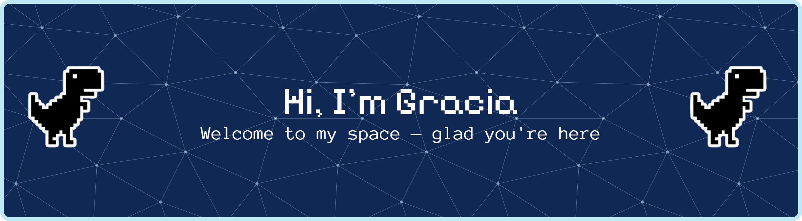

<h2 align="left">Skills</h2>

###

Tools and technologies I’m currently learning and experimenting with.

###

  
  
  
  
  
  
  
  
  
  
  

###

<h2 align="left">Social Media</h2>

###

Connect with me on social media.

###

  
  

###

<h2 align="left">🚀 A quick overview</h2>

###

  
  
  

###

###
<h2 align="left">🎮 Just for Fun</h2>

###

<picture>
  <source media="(prefers-color-scheme: dark)" srcset="https://raw.githubusercontent.com/GraciaRosalinaHindirwan/GraciaRosalinaHindirwan/output/pacman-contribution-graph-dark.svg">
  <source media="(prefers-color-scheme: light)" srcset="https://raw.githubusercontent.com/GraciaRosalinaHindirwan/GraciaRosalinaHindirwan/output/pacman-contribution-graph.svg">
  
</picture>

###